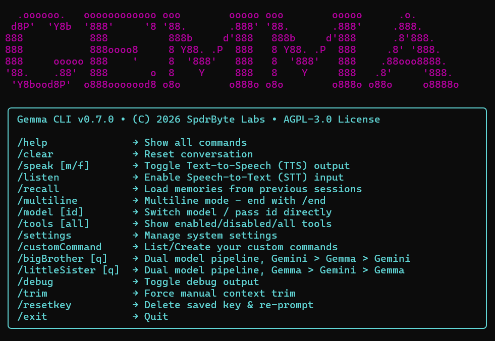

# Gemma CLI: The Professional PowerShell Interface for Gemma 3


Gemma CLI is a high-performance, extensible terminal workstation designed for Google's Gemma 3 model family built entirely on Google's free tier - no subscription required. It brings a sophisticated, tool-aware agent directly into your PowerShell console, enabling AI-driven system administration, web research, and workflow automation. Pre 1.0 versions are experimental builds.

---

## Terminal Interface Demo



The CLI features a custom-built rendering engine that provides structured feedback through color-coded status boxes, a real-time system status bar, and interactive menus.

---

## Architecture Overview

A clean, modular design allows for rapid extension and reliable execution.

```text
GemmaCLI/
├── GemmaCLI.ps1       # Entry point & main interactive loop
├── lib/
│   ├── Api.ps1        # Gemma API wrapper & retry logic
│   ├── UI.ps1         # Console rendering, spinner, & status bar
│   └── ToolLoader.ps1 # Tool discovery & dynamic registration
├── tools/             # Active tools (automatically loaded by the AI)
├── more_tools/        # Tool library (inactive until moved to tools/)
├── config/            # Local configuration files
├── tests/             # Pester test suite
├── instructions.json  # System prompts & model configurations
└── README.md          # You are here
```

---

## Installation & Setup

### Prerequisites
*   **Windows 10/11**: Current version utilizes DPAPI for secure key storage.
*   **PowerShell 5.1+**: Minimum version required; however, **PowerShell 7.4+** is highly recommended for modern terminal features, better ANSI rendering, and faster job management.
*   **Gemma API Key**: Obtain yours for free at [Google AI Studio](https://aistudio.google.com/app/apikey).

### Setup
1.  Clone the repository:
    ```powershell
    git clone https://github.com/SpdrByte/GemmaCLI.git
    cd GemmaCLI
    ```
2.  Launch the CLI:
    ```powershell
    .\GemmaCLI.ps1
    ```
    *On first launch, you will be securely prompted for your API key. It is encrypted using Windows User-level DPAPI (no plain-text keys on disk).*

---

## Interactive Commands

Gemma CLI extends standard chat with a suite of management commands.

| Command | Action |
| :--- | :--- |
| `/help` | Display all available interactive commands |
| `/model` | Switch between 27B, 12B, and specialized models (Interactive) |
| `/tools` | List all active and loaded tools with their parameters |
| `/multiline` | Multiline for coding, pasting multiple lines |
| `/settings` | Toggle UI color schemes and manage active/inactive tools |
| `/customCommand` | Manage custom prompt aliases (e.g., `/poem`, `/fixcode`) |
| `/recall` | Inject long-term memories from previous sessions into context |
| `/debug` | Toggle verbose raw API response and tool-calling logs |
| `/resetkey` | Permanently delete the encrypted API key from this machine |
| `/clear` | Wipe conversation history and reset the current context |
| `exit` | Gracefully quit the session |

---

## Extensibility: Building Custom Tools

The heart of Gemma CLI is its **Dynamic Tool Loader**. To give Gemma a new capability, simply drop a `.ps1` file into the `tools/` folder. The loader will automatically validate it and teach Gemma how to use it.

**Example Tool Structure (`tools/get_weather.ps1`):**
```powershell
function Invoke-WeatherTool {
    param([string]$location)
    # Your logic here...
    return "The weather in $location is sunny."
}

$ToolMeta = @{
    Name        = "get_weather"
    Behavior    = "Use this tool to check current weather. It requires a specific location name."
    Description = "Fetches current weather for a specific city."
    Parameters  = @{ location = "string - city name (e.g., 'New York')" }
    Example     = "<tool_call>{ ""name"": ""get_weather"", ""parameters"": { ""location"": ""London"" } }</tool_call>"
    FormatLabel = { param($params) "get_weather -> $($params.location)" }
    Execute     = { param($params) Invoke-WeatherTool @params }
}


```

## Dual-Model Pipeline: `/bigBrother` & `/littleSister`

Two commands that chain Gemma and Gemini Flash into a multi-round reasoning 
pipeline. `/bigBrother` sends your query to Gemini first for broad knowledge 
coverage, then Gemma applies session context as a correction layer, and Gemini 
synthesizes a final answer. `/littleSister` reverses the order, leading with 
Gemma's context-awareness before Gemini expands with its knowledge base.

Each pipeline uses 3 API calls and displays all intermediate reasoning steps, 
giving you full visibility into how the final answer was constructed.

---

## Reliability & Performance

*   **Context Management**: Automatic history trimming and token budgeting (128k context window support) ensure conversations never crash due to size.
*   **Rate Limit Protection**: Built-in RPM tracking and smart retry wrappers handle Google AI Studio quotas (Free and Pay-as-you-go tiers) gracefully.
*   **Asynchronous Jobs**: Tool calls run in isolated background jobs with user-controlled "Allow/Deny" permissions and manual "Esc" cancellation.

---

## Known Limitations & Constraints

*   **Windows Primary**: Secure key encryption utilizes Windows DPAPI, making this version incompatible with non-Windows systems without modification.
*   **Encoding**: Some legacy PowerShell terminals may require `[Console]::OutputEncoding = [System.Text.Encoding]::UTF8` for perfect Unicode rendering.
*   **RPM Quotas**: Free-tier API keys are limited to 2 RPM on larger models; the CLI handles this with automatic wait-timers.

---

## FAQ

*   Q: Is this free?
    A: Yes. The CLI itself is open-source under AGPL-3.0. The API it uses is Google AI Studio's free tier - no credit card, no subscription. The only limit is Google's per-model rate caps, which Gemma CLI manages automatically. You will never receive a bill for using this as documented. Note: If you configure it with a Google Cloud / Vertex AI API key linked to a billing account, API calls will incur charges.

*   Q: Why use Gemma when you can make Gemini calls on the same free API?
    A: Quota isolation. On the free tier each model has its own per-model RPM and daily cap. If Gemini Flash is throttled, Gemma calls still go through - and vice versa. The dual-agent pipeline takes advantage of this automatically. No runtime authentication. Enter your API key once and it's encrypted locally with Windows DPAPI. No OAuth redirects, no browser sign-in flow mid-session — just a key that works. Backend-agnostic — on the roadmap.

---

## Contributing

This is an open-source project by the community, for the community. Whether you want to fix a bug, improve the UI, or contribute a new tool to `more_tools/`, pull requests are welcome!

1.  Fork the repo and create your feature branch.
2.  Add your tool to `more_tools/` or library fix to `lib/`.
3.  Ensure Pester tests in `tests/` pass.
4.  Submit a PR!

---

**License**: Distributed under the AGPL-3.0 License. See `LICENSE` for more information.
