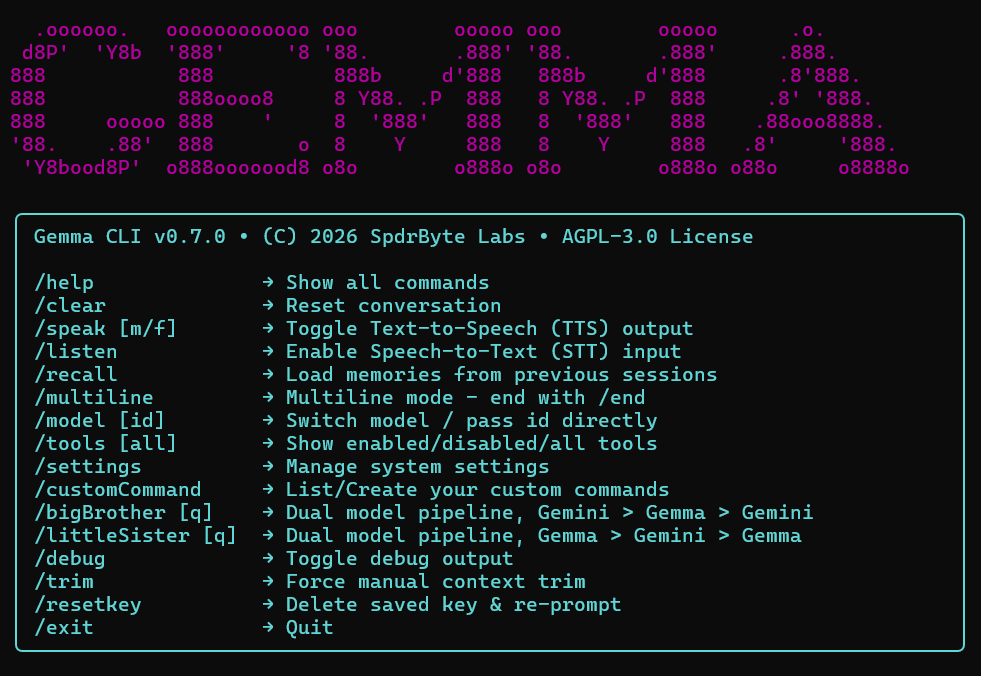
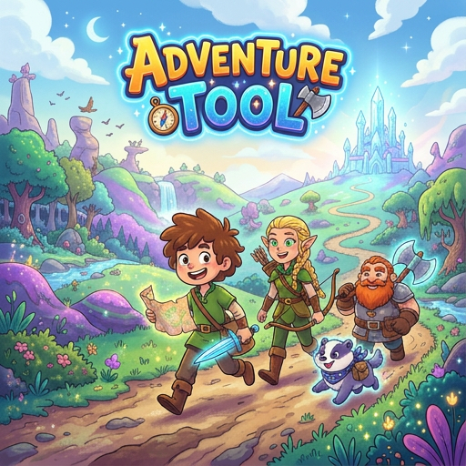
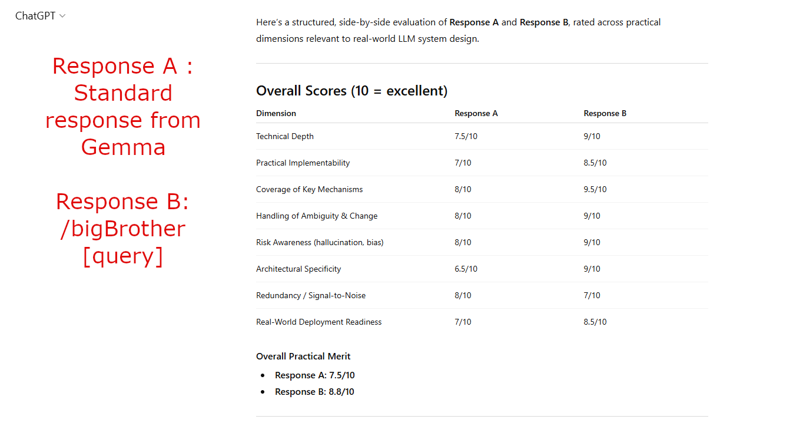

# Gemma CLI: Agentic AI Station for Gemma 4 & 3 - Free AI Agent in your terminal!


[](https://spdrbyte.com)

Gemma CLI is a high-performance, extensible **Agentic AI Station** designed for Google's **Gemma 4** and 3 model families. It brings a sophisticated, tool-aware agent directly into your PowerShell console, enabling AI-driven system administration, web research, physical computing, and professional image generation. Utilizing **MoE (Mixture of Experts)** architectures and advanced **Adversarial Agent** pipelines, it delivers unprecedented reasoning power in a lightweight terminal package.

---

## Terminal Interface Demo



The CLI features a custom-built rendering engine that provides structured feedback through color-coded status boxes, a real-time system status bar, and interactive menus.

---

## 🛠️ Tool Library (45+)

Gemma CLI features a massive suite of specialized tools.

### Featured Tools
|  |  |  |  | 
| :---: | :---: | :---: | :---: |
| **Adventure**<br>RPG state engine | **AI Therapist**<br>Counseling mode | **Calculator**<br>High-precision math | **Chess**<br>Stateful game |
|  |  |  |  |
| **Persona**<br>AI Personalities | **Roll Dice**<br>d4 d6 d8 d10 d12 d20 + | **SearchDir**<br>System discovery | **Background Check**<br>Criminal background check |

### All Categories
1. **System Administration**: `shell`, `git`, `searchdir`, `move_file`, `create_directory`, `writefile`, `readfile`
2. **Coding/Development**: `code_analyzer`, `compare_ps1`, `create_tool`, `build_site`, `git`, `calculator`, `writefile`, `readfile`
3. **Search and Discover**: `brave_search`, `browse_web`, `http_get`, `coingecko`, `lookup`, `searchdir`, `background_check`
4. **Digital Media Production**: `nanobanana`, `resize_image`, `crop_image`, `view_image`, `write_story`, `write_script`
5. **Physical Computing**: `arduino_boards`, `esp_boards`, `ael_validate`, `shell`, `http_get`
6. **Help/Consultation**: `ai_therapist`, `calculator`, `persona`, `write_story`, `summarize_context`
7. **Memory Management**: `remember`, `summarize_context`, `readfile`
8. **Gaming/Entertainment**: `adventure`, `chess`, `blackjack`, `roll_dice`, `cowsay`, `randomname`, `nanobanana`, `persona`

---

## Architecture Overview

A clean, modular design allows for rapid extension and reliable execution.

```text
GemmaCLI/
├── GemmaCLI.ps1       # Entry point & main interactive loop
├── lib/
│   ├── Api.ps1        # Gemma API wrapper & retry logic
│   ├── History.ps1    # Conversation history and context management
│   ├── UI.ps1         # Console rendering, spinner, & status bar
│   └── ToolLoader.ps1 # Tool discovery & dynamic registration
├── tools/             # Active tools (automatically loaded by the AI)
├── more_tools/        # Tool library (inactive until moved to tools/)
├── database/          # Persistent JSON data for tools (RPG, Pets, etc.)
├── assets/            # UI images and tool-specific icons
├── config/            # Local configuration files
├── tests/             # Pester test suite
├── instructions.json  # System prompts & model configurations
└── README.md          # You are here
```

---

## Installation & Setup

### Prerequisites
*   **Windows 10/11**: Current version utilizes DPAPI for secure key storage.
*   **PowerShell 5.1+**: Minimum version required; however, **PowerShell 7.4+** is highly recommended for modern terminal features, better ANSI rendering, and faster job management.
*   **Gemma API Key**: Obtain yours for free at [Google AI Studio](https://aistudio.google.com/app/apikey).

### Setup
1.  Clone the repository:
    ```powershell
    git clone https://github.com/SpdrByte/GemmaCLI.git
    cd GemmaCLI
    ```
2.  Launch the CLI:
    ```powershell
    .\GemmaCLI.ps1
    ```
    *On first launch, you will be securely prompted for your API key. It is encrypted using Windows User-level DPAPI (no plain-text keys on disk).*

---

## Interactive Commands

Gemma CLI extends standard chat with a suite of management commands.

| Command | Action |
| :--- | :--- |
| `/help` | Display all available interactive commands |
| `/model` | Switch between reasoning tiers and specialized models (Interactive) |
| `/tools [all]` | Show enabled/disabled/all tools with parameters and descriptions |
| `/multiline` | Multiline for coding, pasting multiple lines |
| `/settings` | Toggle UI color schemes and manage active/inactive tools |
| `/speak [m/f]` | Toggle Text-to-Speech (TTS) output (Male/Female) |
| `/listen` | Enable Speech-to-Text (STT) input (requires microphone) |
| `/customCommand` | Manage custom prompt aliases (e.g., `/poem`, `/fixcode`) |
| `/recall` | Inject long-term memories from previous sessions into context |
| `/debug` | Toggle verbose raw API response and tool-calling logs |
| `/trim` | Force manual context trim (Semantic Smart Trim or standard FIFO) |
| `/resetkey` | Permanently delete the encrypted API key from this machine |
| `/clear` | Wipe conversation history and reset the current context |
| `/exit` | Gracefully quit the session |

---

## Extensibility: Building Custom Tools


The heart of Gemma CLI is its **Dynamic Tool Loader**. To give Gemma a new capability, simply drop a `.ps1` file into the `tools/` folder. The loader will automatically validate it and teach Gemma how to use it.

**Example Tool Structure (`tools/get_weather.ps1`):**
```powershell
function Invoke-WeatherTool {
    param([string]$location)
    # Your logic here...
    return "The weather in $location is sunny."
}

$ToolMeta = @{
    Name        = "get_weather"
    Behavior    = "Use this tool to check current weather. It requires a specific location name."
    Description = "Fetches current weather for a specific city."
    Parameters  = @{ location = "string - city name (e.g., 'New York')" }
    Example     = "<tool_call>{ ""name"": ""get_weather"", ""parameters"": { ""location"": ""London"" } }</tool_call>"
    FormatLabel = { param($params) "get_weather -> $($params.location)" }
    Execute     = { param($params) Invoke-WeatherTool @params }
}


```

## Dual-Model Pipeline: `/bigBrother` & `/littleSister`

Two commands that chain Gemma and Gemini Flash into a multi-round reasoning 
pipeline. `/bigBrother` sends your query to Gemini first for broad knowledge 
coverage, then Gemma applies session context as a correction layer, and Gemini 
synthesizes a final answer. `/littleSister` reverses the order, leading with 
Gemma's context-awareness before Gemini expands with its knowledge base.



Each pipeline uses 3 API calls and displays all intermediate reasoning steps, 
giving you full visibility into how the final answer was constructed.

---

## Smart Trim & RAG Memory

Smart Trim manages conversation history when it approaches the context window limit (or context is triggering TPM limit). Instead of blindly dropping the oldest turns, it utilizes **RAG (Retrieval-Augmented Generation)** principles: it uses semantic embeddings to score each turn's relevance to your current query and keeps the most useful ones. 

How it works: When history exceeds the token budget, Smart Trim embeds your current message and every candidate history turn using `gemini-embedding`, computes cosine similarity scores, and retains the top N most relevant turns plus the last 4 turns unconditionally. Dropped turns are replaced with a notice so the model knows a trim occurred. If embedding fails for any reason (network, quota), it falls back to blind trimming dropping oldest turns first.

Access via `/settings` → Smart Trim. Additionally, the `/recall` command allows for explicit retrieval of long-term memories across sessions.

---

## Multimodal: Nano Banana Image Generation

Gemma CLI includes the **Nano Banana** suite, a tiered image generation toolset powered by Google's Imagen 4.0 API. It features a smart, two-phase interactive flow to ensure technical compatibility between resolutions and aspect ratios.

### Model Tiers

* 🍌 **Nano Banana**: Powered by Gemini 2.5 Flash. Optimized for speed and high-volume, low-latency 1K assets.
* 🍌 **Nano Banana 2**: Powered by Gemini 3.1 Flash. The high-efficiency tier supporting 512px assets and extreme aspect ratios (1:8, 8:1).
* 🍌 **Nano Banana Pro**: Powered by Gemini 3 Pro. Designed for professional assets, 2K/4K resolution, and high-fidelity text rendering using advanced "Thinking" reasoning.

### Smart Interaction Flow

The CLI handles model selection automatically based on your intent. When you request an image, Gemma guides you through a two-step confirmation:

1. **Phase 1 (Resolution)**: You select your size (512, 1K, 2K, or 4K).
2. **Phase 2 (Dynamic Filtering)**: The tool identifies the best model for that size and returns a filtered list of supported aspect ratios (e.g., extreme ratios are only offered for Nano Banana 2).
3. **Generation**: The final asset is generated and saved to your local temp directory.

---

## Interactive UI: Visual Width Engine

Gemma CLI features a custom-built rendering engine designed for modern terminals.

* **Visual Width Engine**: A sophisticated character measurement system that ensures perfect alignment of emojis, icons, and special Unicode characters across different terminal fonts.
* **Tool Icons & Autonomy**: Every tool now supports custom icons, providing a rich, visual context when Gemma autonomously decides to execute a capability.
* **Dynamic Text Wrapping**: Robust wrapping logic in both status boxes and interactive menus prevents text from escaping borders, even with long titles or complex descriptions.
* **OSC 8 Hyperlinks**: Automatically scans Gemma's responses and tool results for Windows file paths and web URLs. **Ctrl + Click** to open paths instantly in Windows Explorer or your browser.
* **Modern Terminal Support**: Optimized for **Windows Terminal**, providing high-fidelity ANSI rendering and a smooth, status-bar-driven workflow.

---

## Next-Gen Stability & Performance

*   **Loop Safety & Synthesis**: Prevents infinite tool loops. If the configured `max_tool_turns` limit is reached, the CLI forces Gemma to synthesize a final response based on gathered data rather than dropping the turn.
*   **Stability Guards**: Implements a mandatory 2-second gap between API calls and robust RPM tracking to ensure consistent performance on both free and paid reasoning tiers.
*   **Interactive Main-Thread Execution**: Specialized tools (like `ask_user` or game setups) execute directly in the main console thread, allowing for rich, real-time user interaction without losing the background job's stability.
*   **Cascading Fallbacks**: In the event of a quota exhaustion on premium models, the system can automatically fallback to highly efficient secondary models to maintain conversation flow.
*   **Context Management**: Advanced history trimming and token budgeting (supporting 128k+ context windows) ensure long-running sessions remain responsive.

---

## Known Limitations & Constraints

*   **Windows Primary**: Secure key encryption utilizes Windows DPAPI, making this version incompatible with non-Windows systems without modification.
*   **Encoding**: Some legacy PowerShell terminals may require `[Console]::OutputEncoding = [System.Text.Encoding]::UTF8` for perfect Unicode rendering.
*   **RPM Quotas**: Free-tier API keys are limited to 2 RPM on larger models; the CLI handles this with automatic wait-timers.
*   **Tool Limit**: There is no hard limit on tools outside of total context, but it's not recommended to activate more than 12 tools to avoid unpredictable behavior.

---

## FAQ Frequently Asked Questions

*   **Q: Is Gemma CLI an AI agent / agentic AI?**
    A: Yes. Gemma CLI is a fully agentic system. Rather than just answering questions, Gemma autonomously decides when to use tools, chains multiple tool calls together to complete complex tasks, and operates on your local system on your behalf.
In practice this means Gemma can receive a high-level instruction like "find all PowerShell scripts modified this week and summarize what each one does" and execute it end-to-end — searching directories, reading files, and synthesizing results - without you directing each step.

*   **Q: Is this free?**
    A: Yes. The CLI itself is open-source under AGPL-3.0. It's designed to work with the Google AI Studio API, which offers both a free tier and paid options. While you can use Gemma CLI entirely with the free tier, upgrading to a paid plan unlocks higher rate limits and increased usage capacity. Gemma CLI automatically manages rate limits for both tiers.

*   **Q: Why use Gemma when you can make Gemini calls on the same free API?**
    A: Quota isolation and performance. Each model (Gemma and Gemini) has its own rate limits, whether you're using the free or paid tiers. The dual-agent pipeline leverages this to maintain responsiveness even when one model is experiencing rate limits. Paid tiers offer significantly higher rate limits for both models. Unlike Gemini, Gemma can be ran locally with no rate limiting.

*   **Q: Can Gemma create her own tools?**
    A: Yes. Gemma can write the code for new tools - she knows the tool structure and can produce a complete, ready-to-deploy .ps1 file. Hypothetically limitless capability! (arduino-cli implementation - on the roadmap.

---

## Roadmap

* Arduino CLI tool

* System insight tool

* Self-Improvement mode

* Backend Agnostic

* Speech to text feature ✓

* Text to Speech feature ✓

* Image generation ✓

---

## Contributing

This is an open-source project by the community, for the community. Whether you want to fix a bug, improve the UI, or contribute a new tool to `more_tools/`, pull requests are welcome!

1.  Fork the repo and create your feature branch.
2.  Add your tool to `more_tools/` or library fix to `lib/`.
3.  Ensure Pester tests in `tests/` pass.
4.  Submit a PR!

---

## 🛠️ Troubleshooting

### 1. PowerShell Scripts Won't Run (Execution Policy)
**Issue:** You see an error like `...cannot be loaded because running scripts is disabled on this system.`
**Solution:** Windows blocks scripts downloaded from the internet by default. Run this command in a PowerShell terminal to allow locally created and signed remote scripts:
```powershell
Set-ExecutionPolicy -ExecutionPolicy RemoteSigned -Scope CurrentUser
```
Alternatively, you can right-click `GemmaCLI.ps1`, select **Properties**, and check the **Unblock** box at the bottom.

### 2. Emojis or Status Boxes Look Corrupted
**Issue:** UI elements like checkmarks or status bar boxes appear as blocks (`□`) or gibberish.
**Solution:** This occurs when the terminal or font doesn't support full Unicode.
*   **Best Fix:** Use **Windows Terminal** (recommended) for perfect rendering.
*   **Quick Fix:** Ensure your console font is set to a modern font like **Cascadia Code**, **Consolas**, or **JetBrains Mono**.

---

**License**: Distributed under the AGPL-3.0 License. See `LICENSE` for more information.

